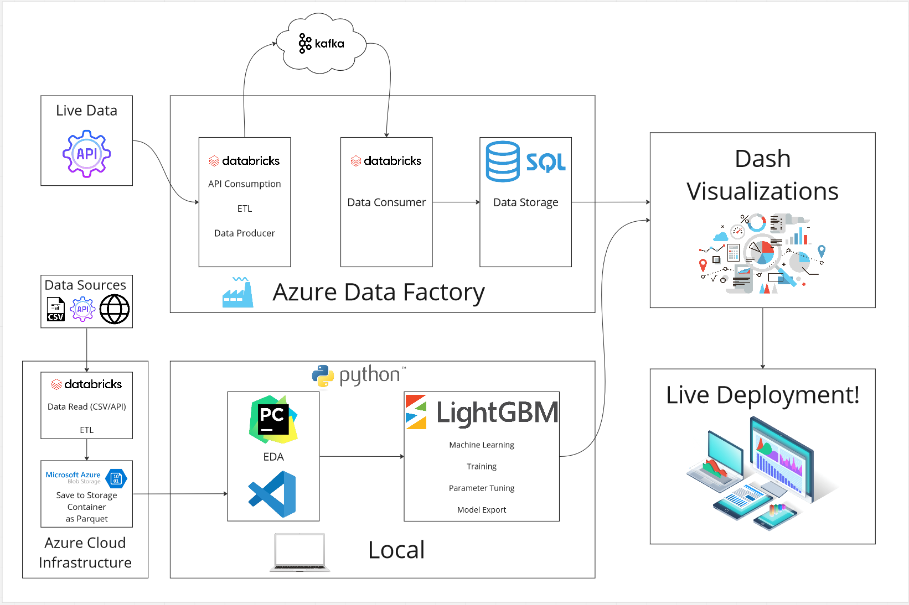

# ETL Report

---

## ETL Process

---

We have 2 ETL proccess. Our 1st procces is used to get training and testing data to use for ML. Our second process is to get live data that we will feed into our final ML model to make predictions.


## Table of Contents
1. [Extract Training/Testing Data](#extract-training-and-testing-data)
## Data Source

---

All data used can be accessed in the [data](https://github.com/shane-sarabdial/WeatherWatts-/tree/main/data) Folder.

1. [EIA](https://www.eia.gov/opendata/browser/electricity/rto/region-data)
2. [Weather](https://www.visualcrossing.com/)
3. [Holidays](https://www.timeanddate.com/holidays/us/)
4. [XLE](https://finance.yahoo.com/quote/XLE?p=XLE&.tsrc=fin-srch)

## Notebooks

---

You can find exact steps to the ETL in the following notebooks.

1. [API Call](https://github.com/shane-sarabdial/WeatherWatts-/blob/main/ETL/API%20Consumption%20of%20Energy%20Data.ipynb)
2. [Holiday Web Scraping](https://github.com/shane-sarabdial/WeatherWatts-/blob/main/ETL/Holiday_Webscrape.py)
3. [Transform Energy and Weather-Apache](https://github.com/shane-sarabdial/WeatherWatts-/blob/main/ETL/Transform%20Energy%20and%20Weather.ipynb)
4. [EDA/mergeing data](https://github.com/shane-sarabdial/WeatherWatts-/blob/main/EDA/EDA_LGBM.ipynb)
5. [Kafka Producer](https://github.com/shane-sarabdial/WeatherWatts-/blob/main/ETL/ETL_Prediction%20Data/Prediction%20Data%20and%20Producer.ipynb)
6. [Kafka Consumer and SQL Load](https://github.com/shane-sarabdial/WeatherWatts-/blob/main/ETL/ETL_Prediction%20Data/Future%20Consumer%20and%20upload%20to%20SQL.ipynb)

## Extract Training and Testing Data

---

1. We will use azure databricks to extract our intial data and do the heavy lifting before we breakup our data into more manageable format to use locally.
2. In a databricks notebook import the Beautifulsoup and datetime libraries. You will also have to sign up for a api key from EIA.
3. In the following code block we create a function that will convert our json response into a data frame. Due to api limitations we can only get 5000 rows back at a time and we have an limit on how many calls be can make at one time. To get around this we create a loop to get 5000 rows and every 50,000 we will sleep for 45 seconds.

```
def json_to_dateframe(response):
    return pd.DataFrame(response.json()['response']['data'][1:], columns= response.json()['response']['data'][0])
````

```
from time import sleep
df_final = pd.DataFrame()
for loc in locations:
    for x in range(0,145_000,5000):
        try:
            url = f'https://api.eia.gov/v2/electricity/rto/region-data/data/?api_key={key}&frequency=hourly&data[0]=value&facets[type][]=D&facets[type][]=NG&facets[respondent][]={loc}&sort[0][column]=period&sort[0][direction]=asc&offset={x}&length=5000'
            response = requests.get(url)
            df = json_to_dateframe(response)
            df_final = pd.concat([df_final,df])
            print(response)
            if x%50000 == 0:
                sleep(45)
        except:
            print('error')
````

4. Once the loop is complete we will write the data to a azure storage blob.
5. We had a preimum subscirption from visual crossing the api for our weather data. We will do a smilar loop for the weather data but no need to sleep.
6. In the following code we will scrape the holiday website. The function below will locate the html container that the holidays and their assocaited dates and converet them into a dataframe. After completing this we will export the data as a csv.

`````
def create_holdidays_df(lst=None):
    if lst == None:
        years = ['2015','2016','2017','2018','2019','2020','2021','2022','2023']
    else:
        years = lst
    Date = []
    holiday = []
    for y in years:
        html = getHTML(y) #creates url to be scraped
        soup = bs(html, 'html.parser')
        table = soup.find('table')
        tbody = table.find('tbody')
        row = tbody.find_all('tr', class_='showrow')
    for r in row:
        holiday.append(r.find_next('a').text)
        Date.append(str(r.find_next('th').text+" "+y))
    data = [Date,holiday]
    holiday_df = pd.DataFrame(data,).T
    holiday_df.rename(columns={0:'Date',1:'Holiday'}, inplace=True)
    holiday_df['Date'] = pd.to_datetime(holiday_df.Date)
    holiday_df['year'] = holiday_df.Date.dt.year
    holiday_df['dayofyear'] = holiday_df.Date.dt.dayofyear
    df = spark.createDataFrame(holiday_df)
    df = df.repartition(1)
    df.write.mode("overwrite").csv('/mnt/weatherwatts/holidays', header=True)
`````

7. To get the XLE data we visit [yahoo finance](https://finance.yahoo.com/quote/XLE?p=XLE&.tsrc=fin-srch) and download the historical data as a csv.
8. We will then read the weather and energy data back into a new databricks from our storage blob. We will import pyspark.sql functions and import the year, month, dayofweek, hour, quarter, and dayofyear functions.
9. We create the following function that will create new columns from our datetime colum. We will pass the weather and energy data into this function.

```
def create_features(dfs):
    dfs = dfs.withColumn("year", year("period"))
    dfs = dfs.withColumn("month", month("period"))
    dfs = dfs.withColumn("days", dayofweek("period"))
    dfs = dfs.withColumn("hour", hour("period"))
    dfs = dfs.withColumn("quarter", quarter("period"))
    dfs = dfs.withColumn("dayofyear", dayofyear("period"))
    return dfs
````

10. For the energy data we will drop the type column and split the dataframe into 2 smaller chunks. We will filler the data where type-name equals demand and create a new dataframe called df_demand. We will repeat this for net generation.
11. After running a quick check for nulls on the weather data we have quite a few columns with too many nulls to be usefull so we will drop them.

```
df2 = df2.drop('windgust')
df2 = df2.drop('severerisk')
df2 = df2.drop('preciptype')
df2 = df2.drop('solarenergy')
df2 = df2.drop('stations')
````

12. This is our intial extraction and transformation. Now that the heavy lifting has been done in pyspark we will export the 3 dataframes we have to a storage blob where they will be brought into our local enviornment to perform transformations. Since the data is still large exporting them as a parquet file is recommended. The parquet file will compress the data making it easier to transfer.

## Transform Training/Testing Data

---

1. You will have to copy the datafiles from your storage blob into your local enviornment. If you exported your data as a parquet the file should be less the 6MB.
2. In your local enviornment import pandas, numpy, and re, and matplotlib.
3. We will use pandas to load in are 4 datasets.
4. Our weather data is clean and no transformations has to be done on the data.
5. The first thing we want to do is take our demand_df and replcace the respondent-name 'Florida' with 'Florida Power and Light'. This is the name of the utility company for Florida. We want to do this so our data is consistent with the rest of the column data.
6. Next we need to make our period column a datatime. You can do this with pandas to_datetime.
7. We need to join our weather data to our demand_df. To do this we make a duplicate column with the respondents name. We will call this column name because the weather data has a column called name, which we will join on. Then we will use a replace function to replace the respondent names with the city names. You could as use a map to do this transformation.
   `

```
respondents =['Electric Reliability Council of Texas, Inc.' ,
              'New York Independent System Operator',
              'Florida Power and Light' ,
               'California Independent System Operator',]
#%%
demand_df['name'] = demand_df['name'].replace(respondents[3], 'Los Angeles')
demand_df['name'] = demand_df['name'].replace(respondents[2], 'Tampa')
demand_df['name'] = demand_df['name'].replace(respondents[0], 'Austin')
demand_df['name'] = demand_df['name'].replace(respondents[1], 'new york city')
````

8. Next we will do a inner join with the weather data on the name and period columns since both dataframes contain these columns.
9. We need to merge XLE to our new dataframe. To do this we first have to make our Date column into a datetime. It is important to set utc =True so all of the data is in the same timezone. We will then create two columns year and dayofyear. The two columns together make a unique combination so that we can join on our demand_weather dataframe.

````
XLE_df = XLE_df.set_index('Date')
XLE_df.index = pd.to_datetime(XLE_df.index, utc=True)
XLE_df = XLE_df[['Adj Close']].copy()
XLE_df['year'] = XLE_df.index.year
XLE_df['dayofyear'] = XLE_df.index.dayofyear
````

10. Before we join we need do some feature enginerring and create 3 new columns. These are lag periods we will use for machine learning. We ill use the pandas shift function to create the lags. After that we can merge on year and day of year using a LEFT join. The stock market doesn't operate on weekends and holidays but we don't want to drop those days from our demand_weather so we need to use a left join.

```
XLE_df['Adj_Close_30D_lag'] = XLE_df['Adj Close'].shift(freq='28D')
XLE_df['Adj_Close_60D_lag'] = XLE_df['Adj Close'].shift(freq='56D')
XLE_df['Adj_Close_3D_lag'] = XLE_df['Adj Close'].shift(freq='4D')
energy_df = pd.merge(energy_df,XLE_df,how='left', on=['year','dayofyear'])
````

11. We will then merge the holidays on year and dayofyear. These columns for holiday we create during the Extract procces. Use a left join.
12. We then check for null and will see that we have alot. This is because XLE and the holidays. It is ok to have nulls in holidays. For the adjusted close columns we want to use a foward fill. This way on weekends and holidays we will have data for XLE. Eg. Saturday will be filled with Fridays data and Sunday will be filled with Saturday. We also have some null from the weather data we will use a forward fill as well. This works because if yesterday there was snow then today there is likely snow.

```
energy_df['value'] = energy_df['value'].ffill()
energy_df['solarradiation'] = energy_df['solarradiation'].ffill()
energy_df['uvindex'] = energy_df['uvindex'].ffill()
energy_df['snow'] = energy_df['snow'].ffill()
energy_df['Adj Close'] = energy_df['Adj Close'].ffill()
energy_df['Adj_Close_30D_lag'] = energy_df['Adj_Close_30D_lag'].ffill()
energy_df['Adj_Close_60D_lag'] = energy_df['Adj_Close_60D_lag'].ffill()
energy_df['Adj_Close_3D_lag'] = energy_df['Adj_Close_3D_lag'].ffill()
````

13. We now have a dataframe with all 4 datasets combined. We now need to set the index to the period and convert it to a datetime. We now have a datetime index making ploting easier.
14. We added a weekend feature using the following code.

```
energy_df["Is Weekend"] = energy_df.index.day_name().isin(['Saturday', 'Sunday'])
````

15. The columns 'conditions' and 'icon' are redundent so we drop them. We will also rename 'respondent-name' to 'respondent'.
16. We then create dummy variables for our categorical data.

```
energy_df = pd.get_dummies(energy_df, columns=['Holiday','Is Weekend'], drop_first=True, dtype=float)
```

17. Some of our columns have a dash or somekind of speical character. LightGBM will throw an error if we keep these in our column names. The following code will remove all the special characters and rename the columns apporpriately.

```
new_names = {col: re.sub(r'[^A-Za-z0-9_]+', '', col) for col in energy_df.columns}
new_n_list = list(new_names.values())
# [LightGBM] Feature appears more than one time.
new_names = {col: f'{new_col}_{i}' if new_col in new_n_list[:i] else new_col for i, (col, new_col) in enumerate(new_names.items())}
energy_df = energy_df.rename(columns=new_names)
```

18. We create a historgram and plot our data and see that their are some outliers. We will breakup our dataframe by State and using pandas query filter out the outliers.

```
NY = energy_df.query("respondent== 'New York Independent System Operator' and value > 11000 and value <32000").copy()
FL = energy_df.query("respondent == 'Florida Power and Light' and value >14000 and value < 49000").copy()
CA = energy_df.query("respondent ==  'California Independent System Operator' and value >15000 and value <46000").copy()
TX = energy_df.query("respondent ==  'Electric Reliability Council of Texas, Inc.' and value <75000 ").copy()
```

19. There are some duplicates in the dataframes so we drop those.

```
TX = TX[~TX.index.duplicated(keep='first')]
NY = NY[~NY.index.duplicated(keep='first')]
CA = CA[~CA.index.duplicated(keep='first')]
FL = FL[~FL.index.duplicated(keep='first')]
```

20. We create 2 more features a lag feature for demand and a forcast feature for temp. Then drop any nulls remaining.(very little)

```
NY['demand_3d_lag'] = NY['value'].shift(72, freq='h')
FL['demand_3d_lag'] = FL['value'].shift(72, freq='h')
CA['demand_3d_lag'] = CA['value'].shift(72, freq='h')
TX['demand_3d_lag'] = TX['value'].shift(72, freq='h')
#%%
NY['Temp_24_hours_ahead'] = NY['temp'].shift(-24, freq='h')
FL['Temp_24_hours_ahead'] = FL['temp'].shift(-24 ,freq='h')
CA['Temp_24_hours_ahead'] = CA['temp'].shift(-24, freq='h')
TX['Temp_24_hours_ahead'] = TX['temp'].shift(-24, freq='h')
#%%
NY.dropna(inplace=True)
FL.dropna(inplace=True)
CA.dropna(inplace=True)
TX.dropna(inplace=True)
```

## Load Training/Testing Data

---

Our data is all clean and ready to be used in machine learning. Export the data to a parquet.

```
NY.to_parquet('../data/ML_Data/NY', engine='pyarrow')
FL.to_parquet('../data/ML_Data/FL', engine='pyarrow')
CA.to_parquet('../data/ML_Data/CA', engine='pyarrow')
TX.to_parquet('../data/ML_Data/TX', engine='pyarrow')
```

## Extract Prediction Data

---

1. We will move back to databricks to extract our data for prediction using our ML model. First we need to import pandas, json, re, pickle, datetime and do a pip install yahooquery.
2. We are predicting 3 days ahead and we are using some lag features. So we need at least 3 days previous and 3 days ahead data. To achieve this for we create some time delta as shown below.

```
delta1 = datetime.timedelta(days=2)
delta2  =datetime.timedelta(days=4)
delta3 = datetime.timedelta(days=-3)
delta4 = datetime.timedelta(days=1)
delta5 = datetime.timedelta(days=3)
today = date.today()
one_day_ahead = today + delta4
two_day_ahead = today + delta1
four_days_ahead = today + delta2
three_days_behind = today +delta3
three_days_ahead = today + delta5
```

2. Load holidays data. This data goes up to 2025 so we do not need to pull new data. Convert the dataframe to pandas.
3. Using yahooquery Ticker function get 'XLE'. The yahooquery is an API library that you can use for free without a API key. Next use the history function and get the last 3 months of XLE data. We will filter the dataframe to get the 'adjclose column. The dataframe has a multindex so we need to unstack it.

```
ticker = Ticker('XLE')
#%%
XLE = ticker.history(period='3mo', interval='1d', adj_timezone=False)['adjclose'].unstack().T
```

4. The following code is produce by visual crossing to use their API. On their website you can click on API builder. We need 4 cities so we customize the code a little to run a for loop over the query. We also want to customize the query string and use the timedelta three_days_behind and four_days_ahead. We four_days_ahead to get some buffer in the data.

```
locations2 = ['Los%20Angeles', 'Tampa', 'Austin','new%20york%20city']
#%%
weather_df = pd.DataFrame()
try:
    for loc in locations2:
        ResultBytes = urllib.request.urlopen(f"https://weather.visualcrossing.com/VisualCrossingWebServices/"
                                             f"rest/services/timeline/{loc}/{three_days_behind}/{four_days_ahead}?"
                                             f"unitGroup=us&include=fcst%2Chours%2Cobs&"
                                             f"key={w_key}&contentType=json")

      # Parse the results as JSON
        jsonData = json.load(ResultBytes)
        for i in range(len(jsonData['days'])):
            day = pd.DataFrame(jsonData['days'][i]['hours'])
            day['name'] = loc.replace('%20',' ')
            weather_df = pd.concat([weather_df,day])

except urllib.error.HTTPError  as e:
  ErrorInfo= e.read().decode()
  print('Error code: ', e.code, ErrorInfo)
  sys.exit()
except  urllib.error.URLError as e:
  ErrorInfo= e.read().decode()
  print('Error code: ', e.code,ErrorInfo)
  sys.exit()
```

5. Next we will run the same loop we did in the extract training/testing, but this time we will not be geting all the data. Customize the query string to use the timedeltas three_days_behind and today.

```
locations =[ "CISO", "ERCO","NYIS","FLA"]
#%%
def json_to_dateframe(response):
    return pd.DataFrame(response.json()['response']['data'][1:], columns= response.json()['response']['data'][0])
#%%
from time import sleep
energy = pd.DataFrame()
for loc in locations:
    try:
        url = f'https://api.eia.gov/v2/electricity/rto/region-data/data/?frequency=hourly&data[0]=value&facets[respondent][]={loc}&facets[type][]=D&facets[type][]=NG&start={str(three_days_behind)}T00&end={str(today)}T00&sort[0][column]=period&sort[0][direction]=desc&offset=0&length=5000&api_key={key}'
        response = requests.get(url)
        df = json_to_dateframe(response)
        energy = pd.concat([energy, df])
    except:
        print('error')
```

## Transform Prediction Data

1. Going back to XLE we need to create a 'future dataframe'. To do this we create a empty dataframe with the index set to the dates. We use pandas data_range to create the dates. Then we will concat our empty dataframe with the XLE dataframe.

```
future = pd.date_range(str(one_day_ahead), str(four_days_ahead), freq='1d', tz='UTC')
#%%
future_df = pd.DataFrame(index=future)
#%%
XLE = pd.concat([XLE, future_df])
```

2. Rename the column 'XLE' to 'Adj Clsoe'. Create all the lag features and use a foward fill to handle nulls.

```
XLE['Adj_Close_3D_lag'] = XLE['Adj Close'].shift(freq='3D')
XLE['Adj_Close_30D_lag'] = XLE['Adj Close'].shift(freq='28D')
XLE['Adj_Close_60D_lag'] = XLE['Adj Close'].shift(freq='56D')
XLE['Adj_Close_30D_lag'] = XLE['Adj_Close_30D_lag'].ffill()
XLE['Adj_Close_60D_lag'] = XLE['Adj_Close_60D_lag'].ffill()
XLE['Adj_Close_3D_lag'] = XLE['Adj_Close_3D_lag'].ffill()
```

4. For then enegry data perform the same transformation done with the training/test step
5. Merge weather and energy on the period and name column. This time however we want to do a right join because we have weather data 1 day ahead that we don't want to lose. Drop all columns that are not in the test/training data.
6. We need to create the time periods columns and weekend feature.

```
demand_weather['year'] = demand_weather.index.year
demand_weather['month'] = demand_weather.index.month
demand_weather['days'] = demand_weather.index.dayofweek
demand_weather['hour'] = demand_weather.index.hour
demand_weather['quarter'] = demand_weather.index.quarter
demand_weather['dayofyear'] = demand_weather.index.dayofyear
demand_weather["Is Weekend"] = demand_weather.index.day_name().isin(['Saturday', 'Sunday'])
```

7. We merge XLE with our demand_weather data using a left join.

```
demand_weather = pd.merge(demand_weather,XLE.iloc[:,1:],how='left', on=['year','dayofyear'])
```

8. Merge Holidays using a outer join. This preserves our future dates and past dates.
9. Fill all columns using ffill and perform all the same steps in transform training/testing
10. We inserting 1 day at a time so we can chop of all the extra days in our dataframe, We want to take the data that is 3 days ahead. Use the timedelta to achieve this.

```
TX  = TX.iloc[(TX.index > str(three_days_ahead))][:24]
NY  = NY.iloc[(NY.index > str(three_days_ahead))][:24]
CA  = CA.iloc[(CA.index > str(three_days_ahead))][:24]
FL  = FL.iloc[(FL.index > str(three_days_ahead))][:24]
```

11. Create a new column called State and assign it to the state of your data. We because we will merge our 4 dataframes back into 1 and we need to know which state the data belongs to. We also need to recreate our 'Date' column as this will be our primary key during loading into SQL.

```
TX_X['State'] = 'TX'
NY_X['State'] = 'NY'
CA_X['State'] = 'CA'
FL_X['State'] = 'FL'
#%%
final_df = pd.concat([TX_X,NY_X,FL_X,CA_X])
#%%
final_df['Date'] = final_df.index
```

12. Convert your final_df into a spark dataframe and then convert your data to a JSON.

## Load Prediction Data

---

1. Setup Kafka Topica and producer. Refer to the notebooks for this step. Then start producing data to kafka with the following code.

```
for i in range(len(json_final)): 
    # print(json_final[i])
    p.produce(confluentTopicName,json.dumps(json_final[i]))
    p.flush()
```

2. Setup Kafka consumer refer to notebook for this step. After consuming the data convert it to a Pandas dataframe and split up the data again using the States column.

```
df_ny = df_from_list_of_dictionaries.query('State == "NY"')
df_tx = df_from_list_of_dictionaries.query('State == "TX"')
df_ca = df_from_list_of_dictionaries.query('State == "CA"')
df_fl = df_from_list_of_dictionaries.query('State == "FL"')
```

3.Create a Database.
4.Load the datainto the database.

```
df_ny.write.format("jdbc").option(
    "url", f"jdbc:sqlserver://{server}:1433;databaseName={database};"
    ) \
    .mode("append") \
    .option("dbtable", tableNY) \
    .option("user", user) \
    .option("password", password) \
    .option("driver", "com.microsoft.sqlserver.jdbc.SQLServerDriver") \
    .save()
#%%
df_ca.write.format("jdbc").option(
    "url", f"jdbc:sqlserver://{server}:1433;databaseName={database};"
    ) \
    .mode("append") \
    .option("dbtable", tableCA) \
    .option("user", user) \
    .option("password", password) \
    .option("driver", "com.microsoft.sqlserver.jdbc.SQLServerDriver") \
    .save()
#%%
df_tx.write.format("jdbc").option(
    "url", f"jdbc:sqlserver://{server}:1433;databaseName={database};"
    ) \
    .mode("append") \
    .option("dbtable", tableTX) \
    .option("user", user) \
    .option("password", password) \
    .option("driver", "com.microsoft.sqlserver.jdbc.SQLServerDriver") \
    .save()
#%%
df_fl.write.format("jdbc").option(
    "url", f"jdbc:sqlserver://{server}:1433;databaseName={database};"
    ) \
    .mode("append") \
    .option("dbtable", tableFL) \
    .option("user", user) \
    .option("password", password) \
    .option("driver", "com.microsoft.sqlserver.jdbc.SQLServerDriver") \
    .save()
```

Once the data is loaded into the database. Use azure designer by double clicking the table name. Change the Date column to the primary key and make it a datetime.

